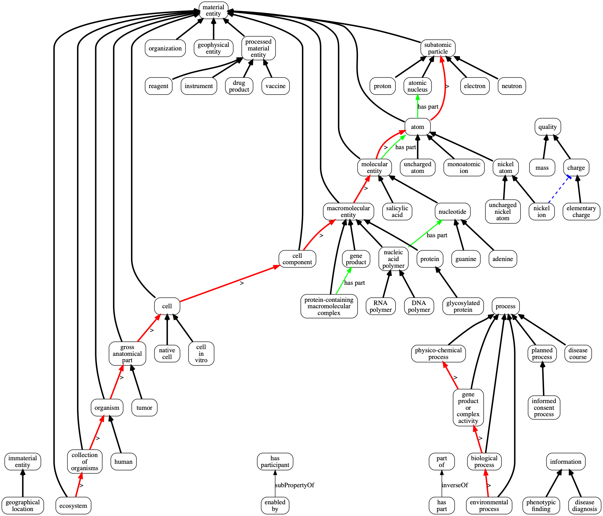
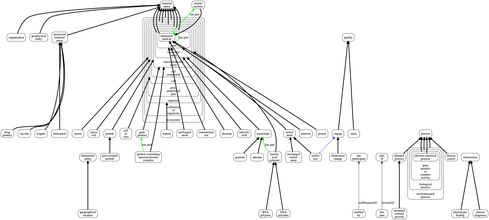

# Experimental-OBO-Core

This project is an experiment that brings together key terms from a wide range of [Open Biological and Biomedical Ontology (OBO)](http://obofoundry.org) projects into a single, small ontology. The goal is to improve interoperabilty and reuse across the OBO community through better coordination of key terms. Our plan is to keep this ontology small, but ensure that some OBO Core term or terms can be used as the root of any given OBO library ontology.

Our current list of OBO Core terms is work in progress: [OBO Core Term Discussion](https://docs.google.com/spreadsheets/d/1DHU6EktJKuOShV_vK-gKLK6b5RwXG021kAfpqWkcKIU/edit#gid=0).

We use [ROBOT](http://robot.obolibrary.org) to build extract those terms and build an experimental OWL file.

To suggest adding a term to OBO Core, please submit an issue to our tracker.

## Viewing OBO-Core

We recommend using Protege.

You can also look at pre-rendered PNGs (made using [obographviz](https://www.npmjs.com/package/obographviz)):

With nesting over `levels` relationship:

 
